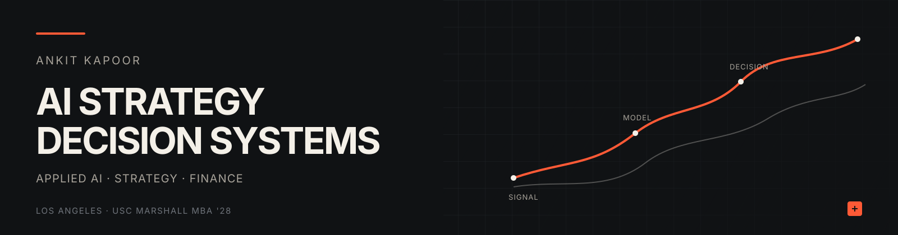
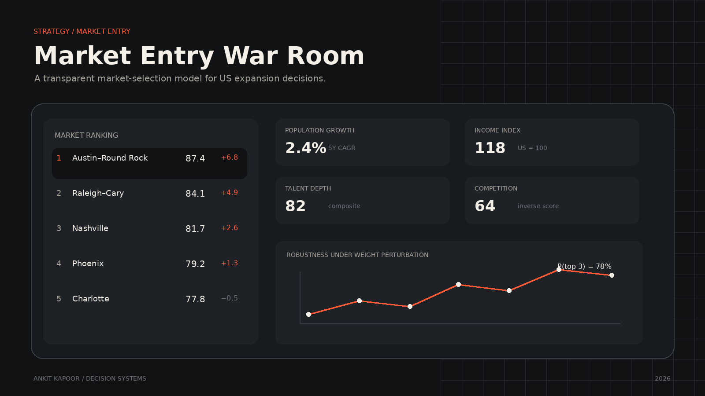
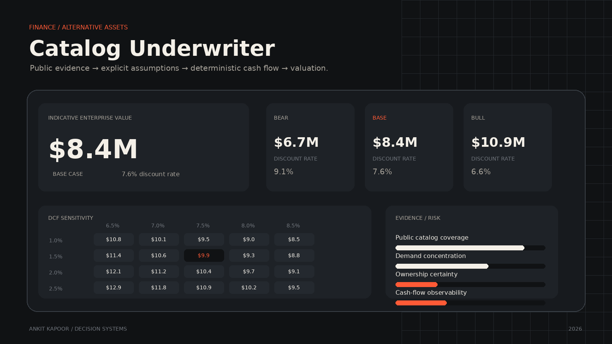
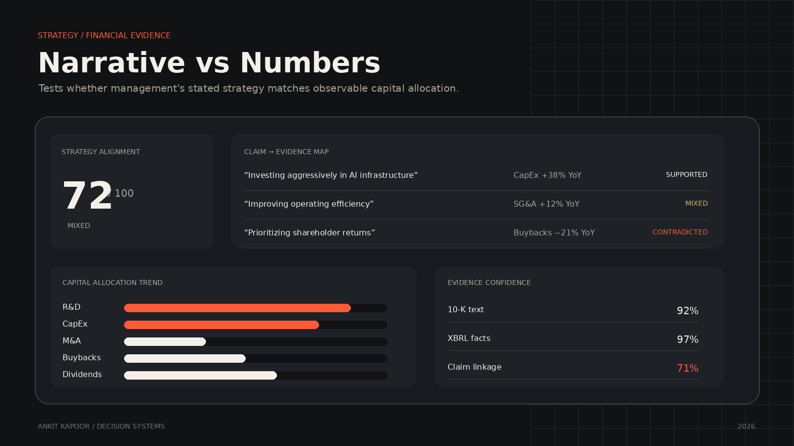

 

### I build tools for decisions that are hard to make.

**AI Strategy · Applied AI · Decision Systems**

USC Marshall MBA '28 · Former ML & Conversational AI Engineer

[Portfolio](https://ankitkapoor.me) · [LinkedIn](https://www.linkedin.com/in/ankitkapooor/) · [Projects](#selected-work)

---

### What I'm interested in

My background is in machine learning and conversational AI. My current work sits one layer above the model itself:

**Where should AI be deployed? What evidence should a decision rely on? How do you make assumptions explicit? And how do you turn messy information into something a decision-maker can actually use?**

I build analytical products at the intersection of **technology, strategy, finance, and decision science** — usually around questions where the answer is less interesting than the reasoning that produces it.

---

## Selected work

<table>
<tr>
<td width="50%" valign="top">

### Market Entry War Room

**Where should a company expand next?**

A decision-support system for comparing US metropolitan markets using public Census data, explicit strategic assumptions, adjustable weighting, and Monte Carlo sensitivity analysis.

**Decision problem:** Market selection  
**Methods:** Scoring models · ACS data · Sensitivity analysis · Monte Carlo

[Live product](https://market-entry-war-room-production.up.railway.app/ui/) · [Repository](https://github.com/ankitkapooor/market-entry-war-room)

</td>
<td width="50%" valign="top">

### Catalog Underwriter

**What can public evidence tell us about the value of a music catalog?**

An underwriting workbench that reconstructs public catalog evidence, makes economic assumptions explicit, models cash flows, and tests valuation across scenarios and sensitivities.

**Decision problem:** Asset underwriting  
**Methods:** DCF · Scenario analysis · Concentration · Sensitivity analysis

[Repository](https://github.com/ankitkapooor/catalog-underwriter)

</td>
</tr>

<tr>
<td width="50%" valign="top">

### Narrative vs Numbers

**Does management allocate capital in line with the strategy it communicates?**

A research tool that extracts strategic claims from SEC filings and tests them against structured financial evidence.

**Decision problem:** Strategy credibility  
**Methods:** SEC filings · XBRL · LLM extraction · Financial analysis

[Live product](https://narrative-vs-numbers-production.up.railway.app/) · [Repository](https://github.com/ankitkapooor/narrative-vs-numbers)

</td>
<td width="50%" valign="top">

### What I'm building next

More tools that turn ambiguous strategic questions into explicit decision models.

Areas I'm especially interested in:

**AI transformation**  
**Corporate strategy**  
**Alternative assets**  
**Competitive intelligence**  
**Decision support**

[See everything →](https://ankitkapoor.me)

</td>
</tr>
</table>

---

## The intersection I work at

| Strategy | AI & Engineering | Decision Science |
| :--- | :--- | :--- |
| Market entry | LLM applications | Scenario analysis |
| AI transformation | Agents & RAG | Sensitivity analysis |
| Business models | Data pipelines | Explicit assumptions |
| Capital allocation | Applied ML | Evidence quality |
| Competitive analysis | Product engineering | Valuation |

The technical system matters. So does the business question it is being built to answer.

---

## Background

Before business school, I worked in **machine learning and conversational AI**, building systems across NLP, generative AI, and enterprise knowledge applications.

I studied Computer Science at **BITS Pilani, Dubai**, where my academic work included research in Natural Language Generation and generative AI before the current LLM wave.

I'm now pursuing my **MBA at USC Marshall**, focusing on the intersection between technical feasibility and strategic value: how emerging technology changes business models, operating models, capital allocation, and competitive advantage.

---

<strong>Earlier AI / ML work</strong>

 

My older repositories document how I got here — NLP systems, conversational AI, recommendation systems, ML experiments, and generative-language projects built during university.

A few of them:

- **MedBot** — generative conversational system built on distilled GPT-2 for medical-domain dialogue
- **Villager** — open-domain conversational generation using GPT-2 and Topical-Chat
- **Luna** — NLP-based conversational assistant
- **Heart Disease Prediction** — comparative ML research project
- **Collatz Conjecture** — procedural generative-art experiment

I keep these repositories public because they show the technical foundation underneath the work I'm doing today.

---

### Build the model. Question the assumptions. Make the decision legible.

[ankitkapoor.me](https://ankitkapoor.me) · [LinkedIn](https://www.linkedin.com/in/ankitkapooor/)

